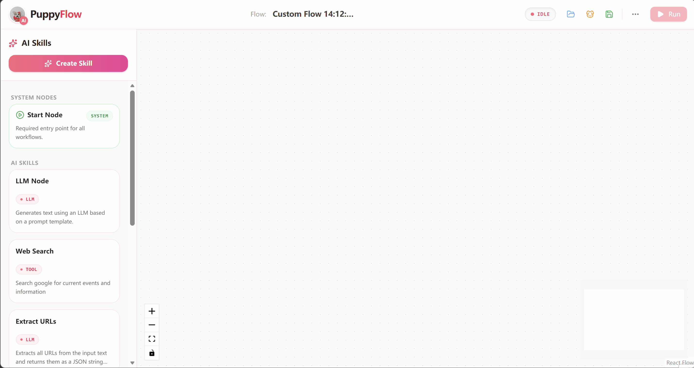
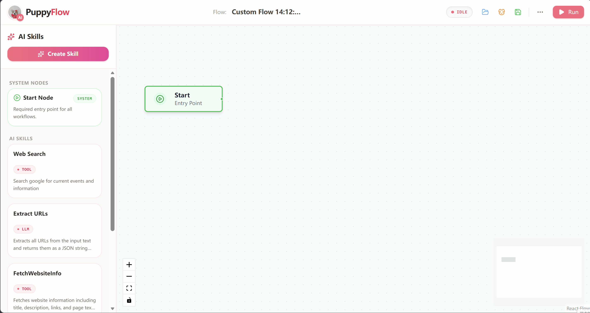
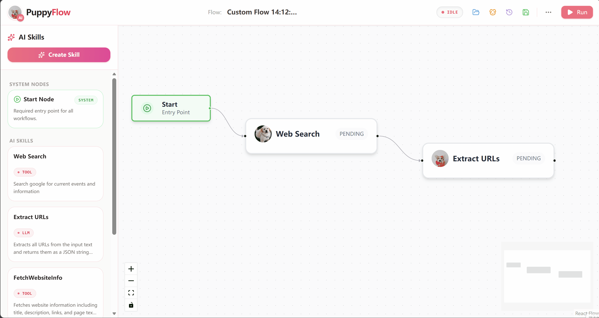
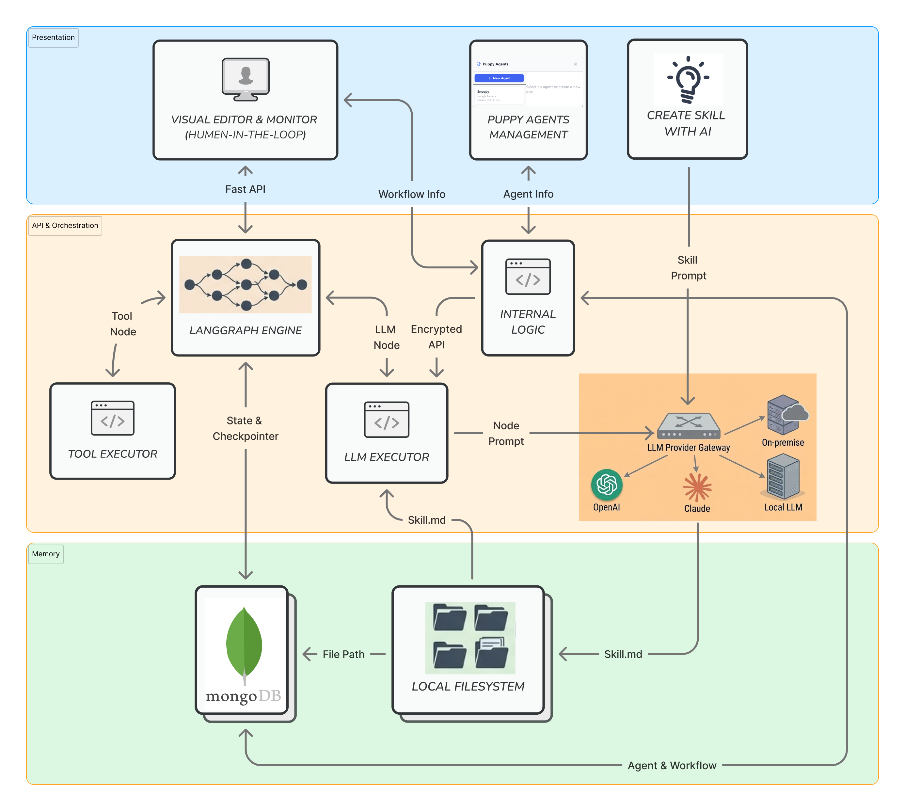

# PuppyAgentFlow

PuppyAgentFlow is a demo-stage **AI agent workflow system** that aims to:

- Let non-technical users **easily build their own workflows**
- Insert **human review / human-in-the-loop** at critical steps
- Avoid **forgetting important execution steps** in automated flows

---

## Demo

### Create Agent



### Easy Drag and Drop



### Run Workflow



---

## Architecture



- **Workflow for ordinary users** — compose steps, reuse agents/skills, see where human review is needed.
- **Human-in-the-loop** — manual checkpoints for sensitive or irreversible actions.
- **Extensible** — plug different LLM backends via unified agent/skill APIs.

---

## Tech Stack

| Layer    | Stack                                        |
| -------- | -------------------------------------------- |
| Backend  | Python, FastAPI, LangGraph, MongoDB (Beanie) |
| Frontend | React, Vite, TypeScript, React Flow          |
| Tests    | pytest (backend), Playwright (frontend)      |

---

## Quick Start

**Prerequisites:** Python 3.x, Node.js, MongoDB (local or remote)

1. **Backend**

   ```bash
   cd backend
   python -m venv .venv
   .\.venv\Scripts\Activate.ps1   # Windows PowerShell
   pip install -r requirements.txt
   uvicorn app.main:app --reload
   ```

2. **Frontend** (new terminal)

   ```bash
   cd frontend
   npm install
   npm run dev
   ```

3. Open `http://localhost:5173` — create workflows, add human-review nodes, run and observe.

---

## Testing

**Backend** (from `backend/`):

```bash
pytest
```

**Frontend** (from `frontend/`):

```bash
npx playwright test
```

E2E test requires backend + MongoDB running.

---

## Future

- Richer workflow visualization (statuses, logs, re-run failed nodes)
- More human-review patterns (multi-step, different strategies)
- Better persistence and deployment story
